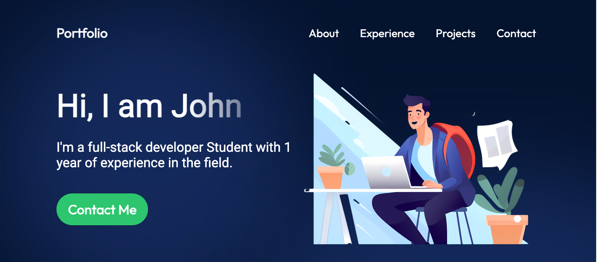

# React Portfolio Description
Module 20 challenge - An updated portfolio showcasing my full stack dev projects. Contains 2 projects, an about me, and the ability to contact me directly.

## Table of Contents
- [Live Site](#live-site)
- [Preview](#preview)
- [Tech Used](#tech-used)
- [Installation](#installation)
- [Usage](#usage)
- [Contribution](#contribution)
- [Questions](#questions)

### Live Site
https://github.com/johnlott1/challenge-20

### Preview 

### Tech Used

Dependencies: 
- "react": "^18.2.0",
- "react-dom": "^18.2.0",
- "vite": "^4.4.5",

## Installation 

To install this project into your own, use `git clone <REPONAME>` in your command-line, then `npm init` to install the listed dependencies.

## Usage 

To use this repo, go to the cloned files, then type `npm start` in your command-line. Be sure you’re in the correct location in your command-line/terminal first! Be sure you're also set up to run a react app!

## Contribution

I am not accepting any contributions at this time.

## Questions
Reach out to the repo owner, [JohnLott](https://github.com/johnlott1) by 